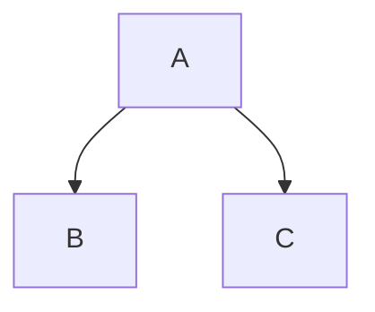

Perfeito ✅ — você quer **somente o conteúdo textual** (os dizeres, títulos e descrições) que devem aparecer **na landing page**, com base no projeto **Referral MVP**, e **sem nenhum código, markdown ou formatação técnica**.

Abaixo está o texto completo — escrito de forma natural, clara e com o mesmo estilo de comunicação do site *Indica Saúde Docs* (informativo, objetivo e profissional):

---

## **Referral MVP — Sistema de Encaminhamentos**

O **Referral MVP** é um sistema desenvolvido para facilitar e gerenciar o processo de encaminhamentos entre profissionais, indicadores e pacientes.
Com ele, todo o fluxo de indicação é digitalizado, organizado e rastreável, permitindo mais eficiência na comunicação entre as partes e maior controle sobre cada atendimento.

---

### **Propósito do Projeto**

O objetivo principal do Referral MVP é oferecer uma solução simples e segura para criar, acompanhar e finalizar encaminhamentos.
O sistema foi desenhado para atender clínicas, hospitais, operadoras e profissionais de saúde que necessitam de um meio centralizado para gerenciar indicações e agendamentos.

---

### **Principais Funcionalidades**

* **Cadastro de usuários e profissionais**
  Registre perfis de indicadores, profissionais e administradores em um só ambiente.

* **Criação e acompanhamento de encaminhamentos**
  Gere encaminhamentos únicos com código próprio, atribua profissionais e acompanhe o status em tempo real.

* **Gestão de status**
  Acompanhe o ciclo completo do encaminhamento — pendente, agendado e concluído.

* **Agendamentos integrados**
  Registre data e hora dos atendimentos e mantenha o histórico de cada paciente.

* **Notificações automáticas**
  O sistema pode se integrar a serviços externos para alertas, lembretes e atualizações.

* **Autenticação segura**
  Acesso protegido por tokens JWT ou provedores externos, como AWS Cognito ou Auth0.

---

### **Para Quem é o Referral MVP**

* **Profissionais de saúde** que recebem e executam encaminhamentos.
* **Indicadores e secretarias** que realizam o direcionamento de pacientes.
* **Gestores e administradores** que precisam acompanhar fluxos, métricas e desempenho do processo de indicação.

---

### **Benefícios**

* Reduz erros e perda de informações entre etapas.
* Centraliza a comunicação entre indicador e profissional.
* Aumenta a transparência e a rastreabilidade dos encaminhamentos.
* Facilita relatórios e análise de desempenho.
* Melhora a experiência de pacientes e equipes.

---

### **Como Funciona**

1. O indicador cria o encaminhamento e o envia para o profissional.
2. O profissional visualiza a solicitação, define uma data e agenda o atendimento.
3. O status é atualizado automaticamente e todos os envolvidos são notificados.
4. Após o atendimento, o encaminhamento é concluído e registrado no histórico.

---

### **Tecnologia e Arquitetura**

O Referral MVP foi projetado com base em uma arquitetura moderna e escalável.
Conta com API desenvolvida em Node.js e banco de dados PostgreSQL, integrando-se a serviços de autenticação, notificações e agenda.
O frontend pode ser implementado em Next.js ou React, garantindo desempenho e boa experiência de uso.

---

### **Segurança e Confiabilidade**

A segurança é prioridade.
Todos os dados trafegam de forma criptografada, e o controle de acesso é feito por perfis e permissões (RBAC).
O sistema também possui logs estruturados, métricas e rastreamento de eventos para garantir confiabilidade e auditoria completa.

---

### **Próximos Passos**

* Integração com serviços de calendário (Google, Microsoft).
* Envio automático de notificações por e-mail e SMS.
* Painel administrativo com relatórios e indicadores de desempenho.
* Suporte multilíngue e personalização de fluxos.

---

### **Nosso Compromisso**

O Referral MVP nasceu com a missão de simplificar a jornada de encaminhamentos na saúde, conectando pessoas, processos e tecnologia em uma única plataforma eficiente, segura e fácil de usar.

---

Deseja que eu formate esse texto para um **tom mais institucional/marketing** (como uma landing comercial) ou mantenho **esse tom técnico-profissional** de documentação?
